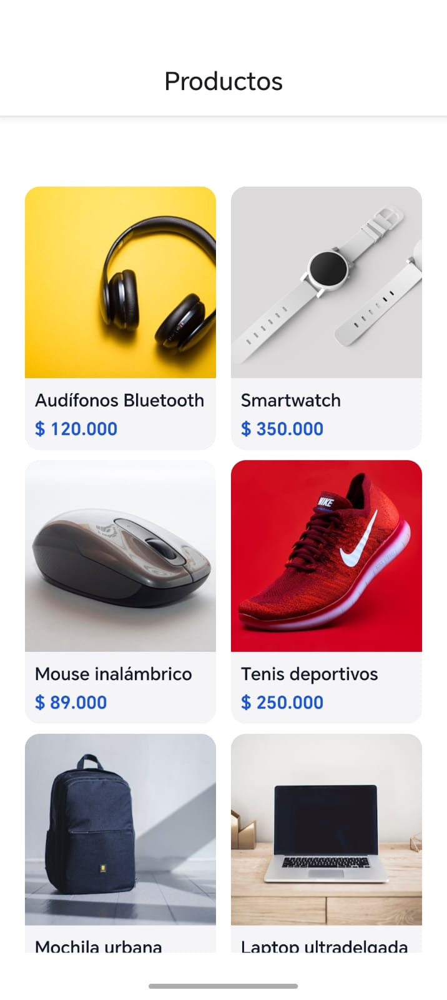
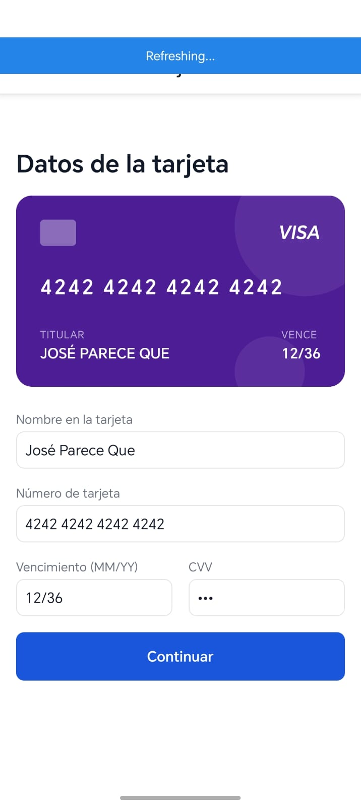
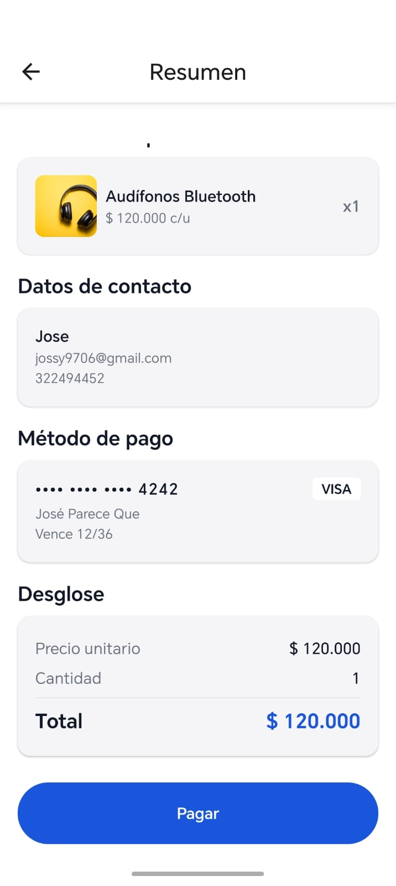
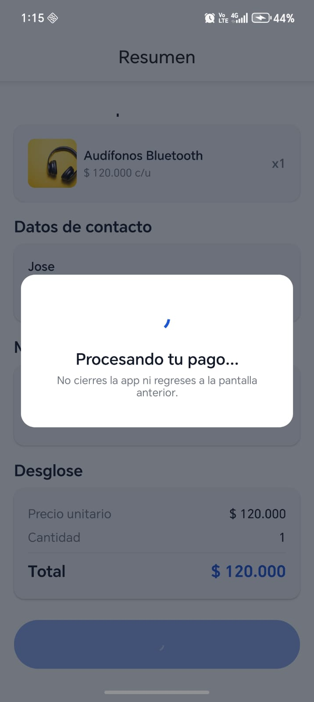
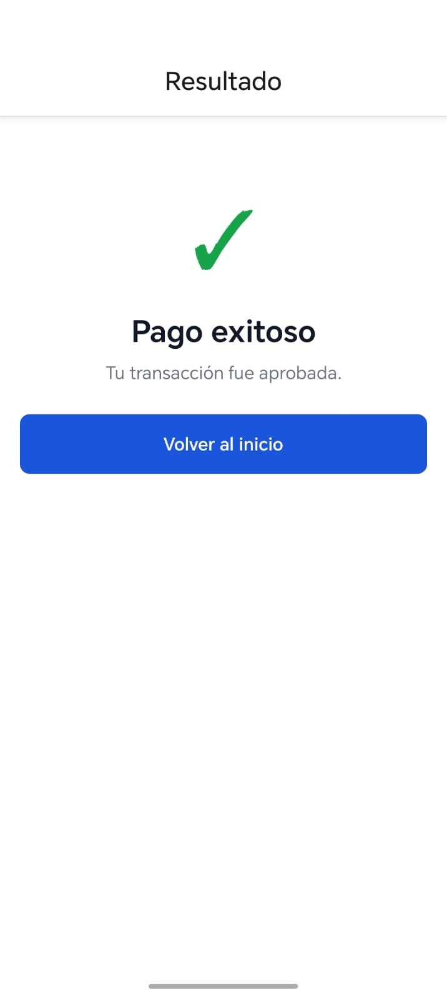

# mobileTestApp

Aplicación de checkout de extremo a extremo: catálogo de productos, captura de datos de cliente, tokenización de tarjeta y procesamiento de pago contra el sandbox de un gateway de pagos.

Monorepo con dos proyectos independientes:

- [`frontend/`](frontend/README.md) — aplicación React Native (Android/iOS): navegación, formularios, estado global con Redux y persistencia cifrada.
- [`backend/`](backend/README.md) — servicio NestJS con arquitectura hexagonal: catálogo, transacciones e integración con el gateway de pagos (API + webhook firmado).

Cada carpeta tiene su propio `package.json`, dependencias y `.gitignore`. Consulta el README de cada una para instrucciones específicas de instalación, ejecución, pruebas, variables de entorno y decisiones técnicas.

## Descargar el APK

[`docs/apk/mobileTestApp-release.apk`](docs/apk/mobileTestApp-release.apk) — build de release lista para instalar (firmada con el keystore de debug). Apunta al backend desplegado en Railway, no requiere backend local.

## Arranque rápido de punta a punta

```sh
# 1. Backend + Postgres (aplica migraciones automáticamente)
cd backend
cp .env.example .env   # completa las llaves del gateway de pagos
docker compose --env-file .env up -d --build

# 2. Frontend
cd ../frontend
cp .env.example .env   # apunta API_BASE_URL al backend anterior
npm install
npm start
# en otra terminal:
npm run android
```

## Proceso de pago

Flujo completo de compra, de punta a punta, tal como lo ve el usuario en la app:

| | |
|---|---|
| **1. Catálogo** — el usuario elige un producto del listado. |  |
| **2. Datos de la tarjeta** — el formulario de tarjeta muestra una preview en vivo que se va llenando con el número, titular y vencimiento a medida que se escriben. |  |
| **3. Resumen de pago** — producto, datos de contacto, método de pago (número enmascarado) y desglose del total antes de confirmar. |  |
| **4. Procesando el pago** — overlay no descartable mientras se crea la transacción: bloquea el gesto de retroceso, la flecha del header y el botón físico de retroceso en Android para evitar que el usuario abandone la pantalla a mitad del proceso. |  |
| **5. Resultado** — confirmación del pago aprobado (o del error, si el gateway lo rechaza). |  |

## Pruebas unitarias

Cada proyecto corre su propia suite con Jest de forma independiente.

```sh
# Backend (NestJS)
cd backend
npm test              # suite completa — 70 tests / 22 suites
npm run test:cov      # con reporte de cobertura

# Frontend (React Native)
cd frontend
npm test              # suite completa — 122 tests / 30 suites
npm test -- --coverage
```

| | Backend | Frontend |
|---|---|---|
| Tests | 70 | 122 |
| Suites | 22 | 30 |
| Cobertura | **100%** sobre código con lógica de negocio | **~98%** |
| Mínimo exigido (`coverageThreshold`) | 80% | 80% |

**Backend** — casos de uso, mappers, value objects y adaptadores probados con mocks planos (sin levantar Nest ni Prisma), gracias a la arquitectura hexagonal con puertos como clases abstractas:
- Casos de uso de `application/` (productos y transacciones), incluida la reconciliación de transacciones `PENDING` contra el gateway de pagos.
- Adaptador e integración con el gateway de pagos (firma de integridad, tokenización, consulta de estado).
- Verificación de firma del webhook, filtros, interceptores y validación de configuración/entorno.
- Repositorios Prisma y value objects del dominio (`Money`, etc.).

**Frontend** — componentes, pantallas, slices de Redux, servicios HTTP y utilidades, con `@testing-library/react-native`:
- Pantallas de checkout de extremo a extremo (selección de producto, datos de cliente, formulario de tarjeta con preview en vivo, resumen de pago con overlay de procesamiento, resultado de transacción).
- Slices de Redux (`card`, `checkout`, `order`, `products`, `transaction`) y su persistencia cifrada.
- Servicios de integración (`httpClient`, `productService`, `transactionService`, `wompiClient`) y utilidades de formato/validación (tarjeta, moneda, formularios).

Instrucciones detalladas, decisiones de mockeo y notas de configuración de cada suite están en el README de cada proyecto ([`backend/README.md`](backend/README.md#pruebas), [`frontend/README.md`](frontend/README.md#pruebas)).

## Estado del proyecto

- Backend: 100% de cobertura de pruebas sobre código con lógica de negocio.
- Frontend: ~98% de cobertura de pruebas.
- Docker: build multi-stage verificado de extremo a extremo (migraciones automáticas incluidas).
- Android: build de release (`assembleRelease`) verificado; ver notas de compilación en Windows en el README del frontend.
